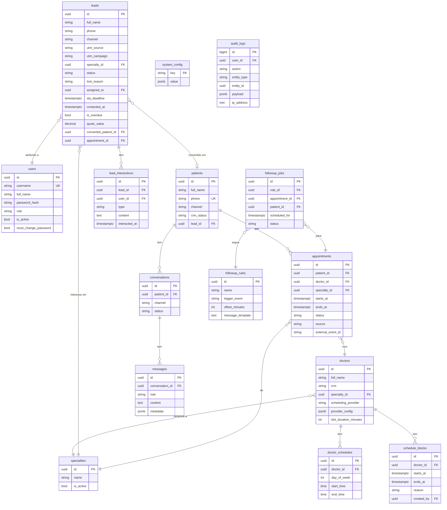

# Schema do Banco de Dados — Open Clinic AI

## Diagrama ER (Mermaid)



---

## SQL Completo

```sql
-- EXTENSÕES
CREATE EXTENSION IF NOT EXISTS "pgcrypto";
CREATE EXTENSION IF NOT EXISTS "btree_gist";  -- para EXCLUDE constraint

-- USUÁRIOS
CREATE TABLE users (
    id                    UUID PRIMARY KEY DEFAULT gen_random_uuid(),
    username              VARCHAR(150) UNIQUE NOT NULL,
    full_name             VARCHAR(255) NOT NULL,
    password_hash         VARCHAR(255) NOT NULL,
    role                  VARCHAR(50) NOT NULL CHECK (role IN ('admin', 'secretary')),
    is_active             BOOLEAN DEFAULT TRUE,
    must_change_password  BOOLEAN DEFAULT TRUE,
    created_at            TIMESTAMPTZ DEFAULT NOW(),
    updated_at            TIMESTAMPTZ DEFAULT NOW()
);

-- ESPECIALIDADES
CREATE TABLE specialties (
    id          UUID PRIMARY KEY DEFAULT gen_random_uuid(),
    name        VARCHAR(100) NOT NULL,
    description TEXT,
    is_active   BOOLEAN DEFAULT TRUE,
    created_at  TIMESTAMPTZ DEFAULT NOW()
);

-- MÉDICOS
CREATE TABLE doctors (
    id                    UUID PRIMARY KEY DEFAULT gen_random_uuid(),
    full_name             VARCHAR(255) NOT NULL,
    crm                   VARCHAR(50),
    specialty_id          UUID REFERENCES specialties(id),
    scheduling_provider   VARCHAR(50) NOT NULL
                          CHECK (scheduling_provider IN ('google_calendar', 'local_db')),
    provider_config       JSONB,
    slot_duration_minutes INTEGER DEFAULT 30,
    is_active             BOOLEAN DEFAULT TRUE,
    created_at            TIMESTAMPTZ DEFAULT NOW(),
    updated_at            TIMESTAMPTZ DEFAULT NOW()
);

-- DISPONIBILIDADE RECORRENTE
CREATE TABLE doctor_schedules (
    id           UUID PRIMARY KEY DEFAULT gen_random_uuid(),
    doctor_id    UUID REFERENCES doctors(id) ON DELETE CASCADE,
    day_of_week  SMALLINT NOT NULL CHECK (day_of_week BETWEEN 0 AND 6),
    start_time   TIME NOT NULL,
    end_time     TIME NOT NULL,
    is_active    BOOLEAN DEFAULT TRUE
);

-- BLOQUEIOS DE AGENDA
CREATE TABLE schedule_blocks (
    id          UUID PRIMARY KEY DEFAULT gen_random_uuid(),
    doctor_id   UUID REFERENCES doctors(id) ON DELETE CASCADE,
    starts_at   TIMESTAMPTZ NOT NULL,
    ends_at     TIMESTAMPTZ NOT NULL,
    reason      TEXT,
    created_by  UUID REFERENCES users(id),
    created_at  TIMESTAMPTZ DEFAULT NOW()
);

-- PACIENTES
CREATE TABLE patients (
    id              UUID PRIMARY KEY DEFAULT gen_random_uuid(),
    full_name       VARCHAR(255),
    phone           VARCHAR(30) UNIQUE NOT NULL,
    email           VARCHAR(255),
    channel         VARCHAR(20) NOT NULL CHECK (channel IN ('telegram', 'whatsapp')),
    channel_id      VARCHAR(100),
    crm_status      VARCHAR(30) NOT NULL DEFAULT 'new'
                    CHECK (crm_status IN ('new', 'qualified', 'scheduled', 'completed', 'no_show')),
    lead_id         UUID,
    notes           TEXT,
    created_at      TIMESTAMPTZ DEFAULT NOW(),
    updated_at      TIMESTAMPTZ DEFAULT NOW()
);

-- LEADS
CREATE TABLE leads (
    id                   UUID PRIMARY KEY DEFAULT gen_random_uuid(),
    full_name            VARCHAR(255),
    phone                VARCHAR(30) NOT NULL,
    email                VARCHAR(255),
    channel              VARCHAR(30) NOT NULL
                         CHECK (channel IN ('telegram','whatsapp','google_ads','meta_ads',
                                            'instagram','site','indicacao','outro')),
    utm_source           VARCHAR(100),
    utm_medium           VARCHAR(100),
    utm_campaign         VARCHAR(255),
    utm_content          VARCHAR(255),
    utm_term             VARCHAR(255),
    specialty_id         UUID REFERENCES specialties(id),
    description          TEXT,
    quote_value          NUMERIC(10,2),
    status               VARCHAR(30) NOT NULL DEFAULT 'novo'
                         CHECK (status IN ('novo','em_contato','qualificado',
                                           'orcamento_enviado','negociando',
                                           'convertido','perdido')),
    lost_reason          VARCHAR(255),
    assigned_to          UUID REFERENCES users(id),
    sla_deadline         TIMESTAMPTZ NOT NULL,
    contacted_at         TIMESTAMPTZ,
    is_overdue           BOOLEAN GENERATED ALWAYS AS (
                             contacted_at IS NULL AND sla_deadline < NOW()
                         ) STORED,
    next_followup_at     TIMESTAMPTZ,
    converted_patient_id UUID REFERENCES patients(id),
    converted_at         TIMESTAMPTZ,
    appointment_id       UUID,
    created_at           TIMESTAMPTZ DEFAULT NOW(),
    updated_at           TIMESTAMPTZ DEFAULT NOW()
);

-- INTERAÇÕES DO LEAD
CREATE TABLE lead_interactions (
    id            UUID PRIMARY KEY DEFAULT gen_random_uuid(),
    lead_id       UUID REFERENCES leads(id) ON DELETE CASCADE,
    user_id       UUID REFERENCES users(id),
    type          VARCHAR(30) NOT NULL
                  CHECK (type IN ('nota','ligacao','whatsapp','email','reuniao','outro')),
    content       TEXT NOT NULL,
    next_action   TEXT,
    interacted_at TIMESTAMPTZ DEFAULT NOW()
);

-- CONVERSAS
CREATE TABLE conversations (
    id              UUID PRIMARY KEY DEFAULT gen_random_uuid(),
    patient_id      UUID REFERENCES patients(id),
    channel         VARCHAR(20) NOT NULL,
    status          VARCHAR(20) DEFAULT 'active' CHECK (status IN ('active', 'closed')),
    started_at      TIMESTAMPTZ DEFAULT NOW(),
    closed_at       TIMESTAMPTZ,
    context_summary TEXT
);

-- MENSAGENS
CREATE TABLE messages (
    id              UUID PRIMARY KEY DEFAULT gen_random_uuid(),
    conversation_id UUID REFERENCES conversations(id) ON DELETE CASCADE,
    role            VARCHAR(20) NOT NULL CHECK (role IN ('patient', 'assistant', 'system')),
    content         TEXT NOT NULL,
    metadata        JSONB,
    sent_at         TIMESTAMPTZ DEFAULT NOW()
);

-- AGENDAMENTOS
CREATE TABLE appointments (
    id                UUID PRIMARY KEY DEFAULT gen_random_uuid(),
    patient_id        UUID REFERENCES patients(id),
    doctor_id         UUID REFERENCES doctors(id),
    specialty_id      UUID REFERENCES specialties(id),
    starts_at         TIMESTAMPTZ NOT NULL,
    ends_at           TIMESTAMPTZ NOT NULL,
    status            VARCHAR(20) DEFAULT 'scheduled'
                      CHECK (status IN ('scheduled','confirmed','completed','cancelled','no_show')),
    source            VARCHAR(30) CHECK (source IN ('ai_chat','secretary','patient_link')),
    external_event_id VARCHAR(255),
    notes             TEXT,
    created_by_user   UUID REFERENCES users(id),
    created_at        TIMESTAMPTZ DEFAULT NOW(),
    updated_at        TIMESTAMPTZ DEFAULT NOW(),
    CONSTRAINT no_overlap EXCLUDE USING gist (
        doctor_id WITH =,
        tstzrange(starts_at, ends_at) WITH &&
    ) WHERE (status NOT IN ('cancelled'))
);

-- FK pendente de appointments
ALTER TABLE leads ADD CONSTRAINT fk_leads_appointment
    FOREIGN KEY (appointment_id) REFERENCES appointments(id);
ALTER TABLE patients ADD CONSTRAINT fk_patients_lead
    FOREIGN KEY (lead_id) REFERENCES leads(id);

-- REGRAS DE FOLLOW-UP
CREATE TABLE followup_rules (
    id               UUID PRIMARY KEY DEFAULT gen_random_uuid(),
    name             VARCHAR(100) NOT NULL,
    trigger_event    VARCHAR(50) NOT NULL
                     CHECK (trigger_event IN ('appointment_scheduled','appointment_confirmed',
                                               'appointment_cancelled','no_show')),
    offset_minutes   INTEGER NOT NULL,
    message_template TEXT NOT NULL,
    channel          VARCHAR(20) CHECK (channel IN ('telegram','whatsapp','same_as_patient')),
    is_active        BOOLEAN DEFAULT TRUE,
    created_at       TIMESTAMPTZ DEFAULT NOW()
);

-- JOBS DE FOLLOW-UP
CREATE TABLE followup_jobs (
    id             UUID PRIMARY KEY DEFAULT gen_random_uuid(),
    rule_id        UUID REFERENCES followup_rules(id),
    appointment_id UUID REFERENCES appointments(id),
    patient_id     UUID REFERENCES patients(id),
    scheduled_for  TIMESTAMPTZ NOT NULL,
    status         VARCHAR(20) DEFAULT 'pending'
                   CHECK (status IN ('pending','sent','failed','cancelled')),
    celery_task_id VARCHAR(255),
    error_message  TEXT,
    executed_at    TIMESTAMPTZ
);

-- CONFIGURAÇÕES DO SISTEMA
CREATE TABLE system_config (
    key        VARCHAR(100) PRIMARY KEY,
    value      JSONB NOT NULL,
    updated_by UUID REFERENCES users(id),
    updated_at TIMESTAMPTZ DEFAULT NOW()
);

-- AUDIT LOG
CREATE TABLE audit_logs (
    id          BIGSERIAL PRIMARY KEY,
    user_id     UUID REFERENCES users(id),
    action      VARCHAR(100) NOT NULL,
    entity_type VARCHAR(50),
    entity_id   UUID,
    payload     JSONB,
    ip_address  INET,
    created_at  TIMESTAMPTZ DEFAULT NOW()
);

-- ÍNDICES
CREATE INDEX idx_patients_phone ON patients(phone);
CREATE INDEX idx_appointments_doctor_starts ON appointments(doctor_id, starts_at);
CREATE INDEX idx_appointments_patient ON appointments(patient_id);
CREATE INDEX idx_followup_jobs_scheduled ON followup_jobs(scheduled_for, status);
CREATE INDEX idx_messages_conversation ON messages(conversation_id, sent_at);
CREATE INDEX idx_leads_status ON leads(status);
CREATE INDEX idx_leads_overdue ON leads(is_overdue, status) WHERE is_overdue = true;
CREATE INDEX idx_leads_channel ON leads(channel);
CREATE INDEX idx_leads_assigned ON leads(assigned_to);
CREATE INDEX idx_leads_created ON leads(created_at DESC);
CREATE INDEX idx_leads_utm_campaign ON leads(utm_campaign) WHERE utm_campaign IS NOT NULL;
CREATE INDEX idx_lead_interactions_lead ON lead_interactions(lead_id, interacted_at DESC);
CREATE INDEX idx_audit_logs_created ON audit_logs(created_at DESC);
CREATE INDEX idx_audit_logs_user ON audit_logs(user_id);
```
